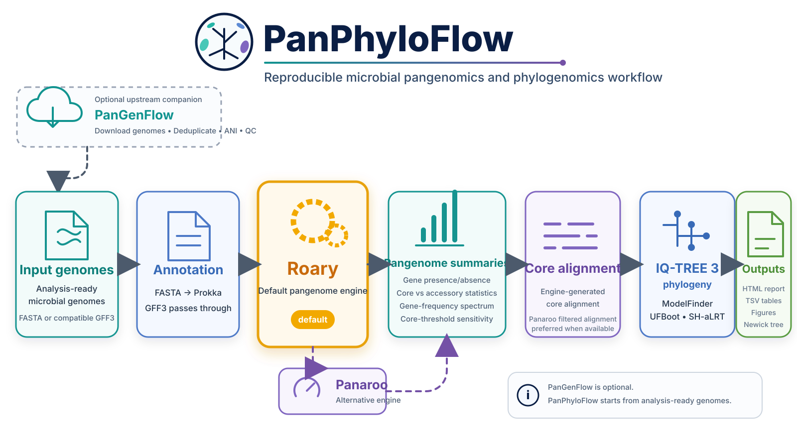

# PanPhyloFlow

[](https://github.com/mbilal-OU/PanPhyloFlow/actions/workflows/python-tests.yml)
[](https://github.com/mbilal-OU/PanPhyloFlow/actions/workflows/nextflow-stub.yml)
[](https://github.com/mbilal-OU/PanPhyloFlow/actions/workflows/docs.yml)
[](LICENSE)

**PanPhyloFlow** is a reproducible and inspectable Nextflow workflow for microbial gene-family pangenomics and core-genome phylogenomics.

**Roary is the current default pangenome engine.** Panaroo is available as an alternative route. The publication release will explicitly re-evaluate whether an analysis engine should remain a silent default or whether users should choose it deliberately.

> **Goal:** automate a genome to pangenome to phylogeny analysis while keeping consequential biological and analytical choices visible, reproducible and open to inspection.

<p align="center">
  
</p>

**Documentation:** [Browse the documentation in this repository](docs/index.md)

> The repository documentation is the canonical entry point. A hosted documentation site should be treated as supplementary until its public URL is verified and stable.

---

## Publication status

PanPhyloFlow is under active publication hardening. Passing unit tests and stub-run CI is not treated as evidence that the workflow has been biologically validated. A stable publication release is blocked on real-data validation, native-output cross-checks, reproducibility testing, provenance capture and reviewer-reproducible example data.

See [Validation strategy](docs/10_validation.md), [Publication readiness](docs/11_publication_readiness.md), and the open publication gate in GitHub issues.

---

## Background

Microbial pangenome results are not determined by genome sequences alone. Sampling, assembly quality, annotation consistency, gene-family inference, clustering thresholds, core-frequency definitions and phylogenetic choices can all change the apparent architecture of a pangenome.

PanPhyloFlow makes those choices visible. It connects established tools into a modular workflow while keeping intermediate files, parameters and interpretations inspectable.

The project is intended for researchers, students and instructors who want a workflow that is both runnable and explainable.

## Questions PanPhyloFlow helps you ask

1. **What is the core and accessory gene content of this genome set?**
2. **How sensitive are core-gene counts to the prevalence threshold used to define core?**
3. **What evolutionary relationships are recovered from the core-genome alignment?**
4. **How do Roary and Panaroo differ when applied to the same analysis-ready genomes?**
5. **Which conclusions are biological observations, and which depend on analysis settings?**

## Inputs

PanPhyloFlow starts from **analysis-ready microbial genomes or compatible GFF3 annotations**.

| Input mode | Samplesheet columns | What happens |
|---|---|---|
| FASTA | `sample,genome` | genomes are annotated with Prokka, then passed to the pangenome engine |
| GFF3 | `sample,gff` | files undergo fail-fast structural validation before pangenome analysis |

Example FASTA samplesheet:

```csv
sample,genome
Genome_A,/absolute/path/Genome_A.fna
Genome_B,/absolute/path/Genome_B.fna
Genome_C,/absolute/path/Genome_C.fna
```

For the current Roary route, Prokka-style sequence-bearing GFF3 is the safest input format. Pre-annotated GFF3 input is checked for a GFF3 header, CDS records, unique CDS IDs, an embedded FASTA section and consistency between feature sequence IDs and embedded FASTA records.

### Annotation status

The current FASTA route uses Prokka to preserve compatibility with the classical Roary workflow. Prokka's upstream maintainer now recommends Bakta for new analysis pipelines, so Prokka should not be interpreted as a claim that it is the preferred modern annotator. A Bakta route should be advertised only after its output has been validated with each supported pangenome engine.

## Pipeline overview

PanPhyloFlow is implemented as a modular Nextflow DSL2 workflow. Each major stage has defined inputs, outputs and software environments.

| Stage | Tool / logic | Main output |
|---|---|---|
| Input validation | PanPhyloFlow validator | validated GFF3 + validation summary for pre-annotated input |
| Annotation | Prokka | standardized GFF3 annotations from FASTA input |
| Pangenome | **Roary (current default)** | gene presence/absence matrix + core alignment |
| Alternative pangenome | Panaroo | graph-cleaned pangenome + core alignment |
| Summary | PanPhyloFlow Python utilities | core/accessory statistics, threshold sensitivity, plots |
| Phylogeny | IQ-TREE 3 | model-selected core-genome tree with support values |
| Reporting | PanPhyloFlow report builder | HTML report, tables, figures and Newick tree |

For Panaroo analyses, PanPhyloFlow prefers `core_gene_alignment_filtered.aln` for phylogeny when that file is produced; otherwise it falls back to the standard core alignment.

## Repository structure

```text
PanPhyloFlow/
├── README.md
├── CHANGELOG.md
├── CITATION.cff
├── CONTRIBUTING.md
├── ROADMAP.md
├── nextflow_schema.json
├── docs/
├── examples/
├── modules/
├── tests/
├── bin/
├── main.nf
├── nextflow.config
└── mkdocs.yml
```

## Quick start

### Requirements

- Java compatible with the selected Nextflow release
- Nextflow
- Conda/Miniconda/Miniforge or compatible solver

Check:

```bash
nextflow -version
conda --version
```

### FASTA input: current Roary route

Create `samples.csv`:

```csv
sample,genome
Genome_A,/absolute/path/Genome_A.fna
Genome_B,/absolute/path/Genome_B.fna
Genome_C,/absolute/path/Genome_C.fna
```

Run:

```bash
nextflow run main.nf \
  -profile conda \
  --input samples.csv \
  --input_type fasta \
  --pangenome roary \
  --threads 8 \
  --outdir results
```

### Pre-annotated GFF3 input

```csv
sample,gff
Genome_A,/absolute/path/Genome_A.gff
Genome_B,/absolute/path/Genome_B.gff
Genome_C,/absolute/path/Genome_C.gff
```

```bash
nextflow run main.nf \
  -profile conda \
  --input samples.csv \
  --input_type gff \
  --pangenome roary \
  --outdir results
```

Invalid or incomplete GFF3 input fails before pangenome inference rather than being silently copied into the analysis.

### Run the Panaroo route

```bash
nextflow run main.nf \
  -profile conda \
  --input samples.csv \
  --input_type fasta \
  --pangenome panaroo \
  --panaroo_clean_mode strict \
  --panaroo_family_threshold 0.70 \
  --core_threshold 0.95 \
  --outdir results_panaroo
```

The two routes currently run separately. A publication-grade same-input comparison mode is planned so method-dependent differences can be reported directly rather than compared manually.

## Test the workflow logic without bioinformatics software

Every process includes a lightweight stub. This checks channel wiring, branching and expected outputs without running the real tools:

```bash
nextflow run main.nf \
  -stub-run \
  --input tests/data/stub_samples.csv \
  --input_type fasta \
  --pangenome roary \
  --outdir stub_results
```

The same wiring is checked automatically in GitHub Actions for both Roary and Panaroo routes. Stub testing is a software-wiring test, not biological validation.

## Results

```text
results/
├── 00_input_validation/             # pre-annotated GFF route
├── 01_annotation/
├── 02_pangenome/
│   └── roary/ or panaroo/
├── 03_summary/
│   └── summary/
├── 04_phylogeny/
│   └── tree/
├── 05_report/
│   ├── index.html
│   ├── figures/
│   ├── core_genome.treefile
│   └── *.tsv
├── execution_trace.tsv
├── nextflow_report.html
├── timeline.html
└── dag.html
```

## Key parameters

| Parameter | Default | Meaning |
|---|---:|---|
| `--pangenome` | `roary` | `roary` or `panaroo`; the publication release will revisit the silent default |
| `--core_threshold` | `0.95` | fraction of genomes required for a family to be treated as core |
| `--roary_identity` | `95` | Roary minimum BLASTP percentage identity |
| `--panaroo_clean_mode` | `strict` | Panaroo graph-cleaning mode |
| `--panaroo_family_threshold` | `0.70` | Panaroo protein-family identity threshold; not equivalent to Roary `-i` |
| `--threads` | `4` | CPUs per computational process |
| `--ufboot` | `1000` | IQ-TREE ultrafast-bootstrap replicates |
| `--sh_alrt` | `1000` | IQ-TREE SH-aLRT replicates |

A machine-readable parameter description is provided in [`nextflow_schema.json`](nextflow_schema.json). Runtime checks in `main.nf` remain authoritative until schema validation is integrated directly into the workflow entry point.

## Scientific guardrails

PanPhyloFlow deliberately does **not** label a pangenome open or closed from a single accumulation trajectory. The default accumulation output is descriptive and uses one seeded genome order. Formal openness modelling should be performed as a separate, explicitly parameterized analysis with appropriate resampling and sampling assumptions.

Likewise, `core_threshold_sensitivity.png` changes only the prevalence definition of a core family. It does not rerun gene-family clustering at different sequence-identity thresholds.

The summary report uses neutral high-frequency, intermediate-frequency and rare-frequency labels for fixed prevalence bins. It does not call a >=95% frequency bin a statistically inferred persistent genome.

Core-genome phylogeny is also not assumed to represent accessory-gene evolutionary history, and the Roary route does not automatically correct the core alignment for homologous recombination.

## Validation status

The repository currently has three validation layers:

1. **Python unit tests** for summary/report logic and pre-annotated GFF validation;
2. **Nextflow stub-run tests** for the complete Roary and Panaroo DAGs;
3. tracked **real-data and publication release gates** that must be completed before the first stable publication release.

See [Validation strategy](docs/10_validation.md) and [Publication readiness](docs/11_publication_readiness.md).

## Optional upstream genome preparation

PanPhyloFlow does **not** require PanGenFlow. It begins with analysis-ready genomes or compatible GFF3 files.

If you still need to download, reconcile GCA/GCF assembly records, inspect metadata or perform genome QC, the separate [`PanGenFlow`](https://github.com/mbilal-OU/PanGenFlow) toolkit can be used beforehand.

## Documentation

Start with [`docs/index.md`](docs/index.md). The tutorial covers:

1. biological scope;
2. inputs and annotation;
3. pangenome construction;
4. core/accessory definitions;
5. core-genome phylogeny;
6. interpretation and failure modes;
7. running and resuming the workflow;
8. Nextflow workflow anatomy;
9. scaling and current limits;
10. validation strategy;
11. publication readiness.

## License

MIT License. See [`LICENSE`](LICENSE).

## Citation

Citation metadata are provided in [`CITATION.cff`](CITATION.cff). Until the software itself has a formal publication or archived release citation, please also cite the underlying tools used in your analysis.
