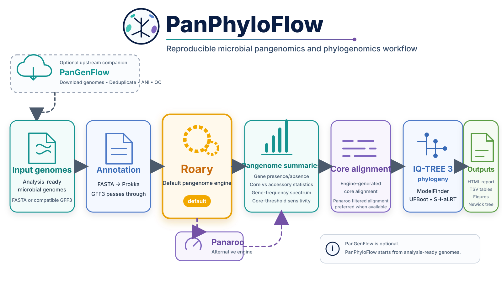

# PanPhyloFlow

[](https://github.com/mbilal-OU/PanPhyloFlow/actions/workflows/python-tests.yml)
[](https://github.com/mbilal-OU/PanPhyloFlow/actions/workflows/nextflow-stub.yml)
[](https://github.com/mbilal-OU/PanPhyloFlow/actions/workflows/real-data-smoke.yml)
[](https://github.com/mbilal-OU/PanPhyloFlow/actions/workflows/docs.yml)
[](LICENSE)
[](CHANGELOG.md)

**Status:** pre-release. Version 0.2.0 is under development and has not been tagged.
The 0.1.0 pre-release defaulted to the Panaroo engine; the default is now Roary.
See [CHANGELOG.md](CHANGELOG.md) for what changed between them.

**PanPhyloFlow** is a reproducible, teaching-oriented Nextflow workflow for classical microbial gene-family pangenomics and core-genome phylogenomics.

**Roary is the default pangenome engine.** Panaroo is available as an alternative route for comparison or graph-aware pangenome reconstruction.

> **Goal:** automate a genome → pangenome → phylogeny analysis without hiding the biological and analytical choices that shape the result.

<p align="center">
  
</p>

**Documentation:** [Browse the documentation in this repository](docs/index.md)

> A GitHub Pages build is also maintained from the `gh-pages` branch. If the public Pages URL is unavailable, the repository documentation link above remains the canonical entry point.

---

## Background

Microbial pangenome results are not determined by genome sequences alone. Sampling, assembly quality, annotation consistency, gene-family inference, clustering thresholds, core-frequency definitions and phylogenetic choices can all change the apparent architecture of a pangenome.

PanPhyloFlow makes those choices visible. It connects established tools into a modular workflow while keeping intermediate files, parameters and interpretations inspectable.

The project is intended for researchers, students and instructors who want a workflow that is both **runnable** and **explainable**.

## Questions PanPhyloFlow helps you ask

1. **What is the core and accessory gene content of this genome set?**
2. **How sensitive are core-gene counts to the prevalence threshold used to define “core”?**
3. **What evolutionary relationships are recovered from the core-genome alignment?**
4. **How do Roary and Panaroo compare when applied to the same analysis-ready genomes?**
5. **Which conclusions are biological observations, and which depend on analysis settings?**

## Inputs

PanPhyloFlow starts from **analysis-ready microbial genomes or compatible GFF3 annotations**.

| Input mode | Samplesheet columns | What happens |
|---|---|---|
| FASTA | `sample,genome` | genomes are annotated with Prokka, then passed to the pangenome engine |
| GFF3 | `sample,gff` | compatible annotations pass directly to pangenome analysis |

Example FASTA samplesheet:

```csv
sample,genome
Genome_A,/absolute/path/Genome_A.fna
Genome_B,/absolute/path/Genome_B.fna
Genome_C,/absolute/path/Genome_C.fna
```

For the **default Roary route**, Prokka-style GFF3 is the safest v0.1.0 input format.

## Pipeline overview

PanPhyloFlow is implemented as a modular Nextflow DSL2 workflow. Each major stage has defined inputs, outputs and software environments.

| Stage | Tool / logic | Main output |
|---|---|---|
| Annotation | Prokka | standardized GFF3 annotations |
| Pangenome | **Roary (default)** | gene presence/absence matrix + core alignment |
| Alternative pangenome | Panaroo | graph-cleaned pangenome + core alignment |
| Summary | PanPhyloFlow Python utilities | core/accessory statistics, threshold sensitivity, plots |
| Phylogeny | IQ-TREE 3 | model-selected core-genome tree with support values |
| Reporting | PanPhyloFlow report builder | HTML report, tables, figures and Newick tree |

For Panaroo analyses, PanPhyloFlow prefers `core_gene_alignment_filtered.aln` for phylogeny when that file is produced; otherwise it falls back to the standard core alignment.

## Repository structure

```text
PanPhyloFlow/
├── README.md
├── CHANGELOG.md
├── CITATION.cff
├── CONTRIBUTING.md
├── docs/
├── examples/
├── modules/
├── tests/
├── bin/
├── main.nf
├── nextflow.config
└── mkdocs.yml
```

## Quick start

### Requirements

- Java compatible with the selected Nextflow release
- Nextflow
- Conda/Miniconda/Miniforge or compatible solver

Check:

```bash
nextflow -version
conda --version
```

### FASTA input: default Roary route

Create `samples.csv`:

```csv
sample,genome
Genome_A,/absolute/path/Genome_A.fna
Genome_B,/absolute/path/Genome_B.fna
Genome_C,/absolute/path/Genome_C.fna
```

Run:

```bash
nextflow run main.nf \
  -profile conda \
  --input samples.csv \
  --input_type fasta \
  --pangenome roary \
  --threads 8 \
  --outdir results
```

### Pre-annotated GFF3 input

```csv
sample,gff
Genome_A,/absolute/path/Genome_A.gff
Genome_B,/absolute/path/Genome_B.gff
Genome_C,/absolute/path/Genome_C.gff
```

```bash
nextflow run main.nf \
  -profile conda \
  --input samples.csv \
  --input_type gff \
  --pangenome roary \
  --outdir results
```

### Compare with Panaroo

```bash
nextflow run main.nf \
  -profile conda \
  --input samples.csv \
  --input_type fasta \
  --pangenome panaroo \
  --panaroo_clean_mode strict \
  --panaroo_family_threshold 0.70 \
  --core_threshold 0.95 \
  --outdir results_panaroo
```

## Test the workflow logic without bioinformatics software

Every process includes a lightweight stub. Running with `-stub-run` executes the
complete DAG with dummy commands, which verifies channel wiring, branching and
the output contracts of each stage without running the real tools:

```bash
nextflow run main.nf \
  -stub-run \
  --input tests/data/stub_samples.csv \
  --input_type fasta \
  --pangenome roary \
  --outdir stub_results
```

GitHub Actions runs the stub DAG for the Roary, Panaroo and GFF-input branches
and asserts the full output contract: all five result stages plus the
provenance record, stub summary values, the Newick treefile, and the published
interpretation notes (see `tests/assert_stub_results.sh`).

## Results

```text
results/
├── 01_annotation/
├── 02_pangenome/
│   └── roary/ or panaroo/
├── 03_summary/
│   └── summary/
├── 04_phylogeny/
│   └── tree/
├── 05_report/
│   ├── index.html
│   ├── figures/
│   ├── core_genome.treefile
│   ├── INTERPRETATION_NOTES.txt
│   └── *.tsv
├── provenance/
│   └── provenance.yml
├── execution_trace.tsv
├── nextflow_report.html
├── timeline.html
└── dag.html
```

Every run records machine-readable provenance in `provenance/provenance.yml`:
pipeline version, Nextflow version, git commit, run/session IDs, the exact
command line, the effective parameters, and the per-process tool versions. Keep
this file with any published result so the analysis can be traced to exact
software.

## Key parameters

| Parameter | Default | Meaning |
|---|---:|---|
| `--input` | *(required)* | Path to the samplesheet CSV |
| `--input_type` | `fasta` | `fasta` (annotate with Prokka) or `gff` (use pre-annotated GFF3) |
| `--outdir` | `results` | Directory for all published results |
| `--pangenome` | `roary` | `roary` or `panaroo` |
| `--core_threshold` | `0.95` | Fraction of genomes required for a family to be treated as core |
| `--roary_identity` | `95` | Roary minimum BLASTP percentage identity |
| `--panaroo_clean_mode` | `strict` | Panaroo graph-cleaning mode |
| `--panaroo_family_threshold` | `0.70` | Panaroo protein-family identity threshold; not equivalent to Roary `-i` |
| `--threads` | `4` | CPUs per computational process |
| `--ufboot` | `1000` | IQ-TREE ultrafast-bootstrap replicates |
| `--sh_alrt` | `1000` | IQ-TREE SH-aLRT replicates |

`--ufboot` and `--sh_alrt` are floored at 1000 by design: support values from
far fewer replicates are not stable enough to report alongside a published
tree, so underpowered settings are rejected rather than silently accepted.
There is currently no supported way to disable supports for a quick smoke
test; use `-stub-run` for wiring checks instead.

## Scientific guardrails

PanPhyloFlow deliberately does **not** label a pangenome open or closed from a single accumulation trajectory. The default accumulation output is descriptive and uses one seeded genome order. Formal openness modelling should be performed as a separate, explicitly parameterized analysis with appropriate resampling and sampling assumptions.

Likewise, `core_threshold_sensitivity.png` changes only the prevalence definition of a core family. It does not rerun gene-family clustering at different sequence-identity thresholds.

Core-genome phylogeny is also not assumed to represent accessory-gene evolutionary history, and the Roary route does not automatically correct the core alignment for homologous recombination.

## Validation status

The repository currently has four validation layers:

1. **Python unit tests** for summary/report logic;
2. **Nextflow stub-run tests** for the complete Roary and Panaroo DAGs;
3. a **weekly real-data smoke test** running the genuine Roary route
   (Prokka → Roary → IQ-TREE) on a tiny real *E. coli* subset
   (`examples/smoke/`), guarding against conda-solve drift and tool breakage;
4. a **real-data release gate**: end-to-end analysis of six RefSeq Complete
   *E. coli* genomes, executed 2026-09-28/29 — both the Roary and Panaroo
   routes completed, summary counts match native engine outputs exactly, and
   the core-genome trees recover K-12 monophyly. Accession list and outcome
   in `examples/real_data/`.

See [Validation strategy](docs/10_validation.md) and the open release-gate issue in GitHub.

## Optional upstream genome preparation

PanPhyloFlow does **not** require PanGenFlow. It begins with analysis-ready genomes or compatible GFF3 files.

If you still need to download, reconcile GCA/GCF assembly records, inspect metadata or perform genome QC, the separate [`PanGenFlow`](https://github.com/mbilal-OU/PanGenFlow) toolkit can be used beforehand.

## Documentation

Start with [`docs/index.md`](docs/index.md). The tutorial covers:

1. biological scope;
2. inputs and annotation;
3. pangenome construction;
4. core/accessory definitions;
5. core-genome phylogeny;
6. interpretation and failure modes;
7. running and resuming the workflow;
8. Nextflow workflow anatomy;
9. scaling and current limits;
10. validation strategy.

## License

MIT License. See [`LICENSE`](LICENSE).

## Citation

Citation metadata are provided in [`CITATION.cff`](CITATION.cff). Until the software itself has a formal publication or archived release citation, please also cite the underlying tools used in your analysis.
